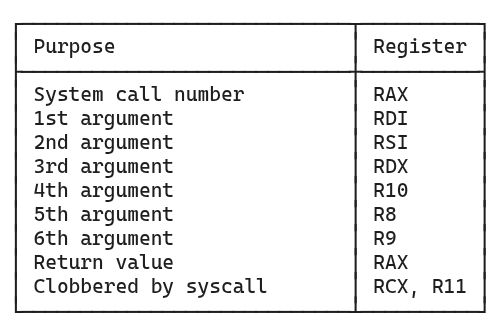

# Mini strace

This is a small educational system-call tracer for Linux-x86-64, built from scratch in C++ using `ptrace()` API. The project intends to explore process tracing, CPU registers and how Linux processes interact with the kernel through system calls and how a debugger/tracer can observe those interactions at system-call boundary and also access CPU registers of the target process. 

--- 

## Features
- Creates a child process using `fork()` 
- Allows the parent process to trace the child process after the child process marks itself for tracing through `PTRACE_TRACEME`
- Executes an arbitrary program using `execvp()`
- It detects entry and exit points of system calls
- Identifies system calls using their syscall numbers stored in `orig_rax` register 
- It maps those syscall numbers to syscall names through `syscall_name()` function
- It extracts all six x86-64 Linux syscall argument registers
- Reads syscall return values 
- Produces a compact output similar to actual `strace` program

Example: 

```text
getdents64(3, 94914686355296, 32768, 9, 94914686355252, 32) = 0
close(3, 94914686355232, 32833, 0, 140678661237448, 32832) = 0
fstat(1, 140734649550016, 140678661230304, 94914686388080, 1, 5) = 0
a.out  main.cpp  README.md
write(1, 94914686355584, 27, 0, 0, 0) = 27
close(1, 94914686355584, 140678661230304, 49, 94914686328880, 48) = 0
close(2, 0, 140678661230304, 1041, 4294967295, 1040) = 0
exit_group(0, 18446744073709551536, 140678662953544, 140734649559408, 0, 1040)
```

## How it works

The program begins by creating a child process with `fork()`. The child process marks itself for tracing using `ptrace()` argument `PTRACE_TRACEME`, the parent then becomes the tracer. The child utilizes `execvp()` function to replace itself with the program the user wants to trace. Because now the child is being traced, after `execvp()` function is executed and child process is replaced by the user's requested program, the kernel generates a `SIGTRAP` signal. `SIGTRAP` is a Unix signal that, roughly speaking, means the child has now stopped because a tracing or debugging event occured. The parent waits for this stop using `waitpid()` function before beginning the syscall tracing cycle. This can be observed through the Signal line generated before the cycle begins. In the code, it is the line ```cout << " (" << strsignal(WSTOPSIG(status)) << ")" << endl;```
WSTOPSIG is a macro that extracts the signal which made the child process to stop. This is converted into human readable format through `strsignal()` function. 

The parent then uses `ptrace(PTRACE_SYSCALL, ...)` to resume the child process and stop it at the next system-call point. A system call has two points that are important to construct the final output: entry and exit. At the entry point, the child requests a system call from the kernel, but the kernel has not completed its operations yet. At this point, The CPU registers contain information about the system call to be made and the arguments that are going to be passed to it. For example, for `write(1, "hello", 5)`, the registers contain the information needed by the kernel to perform that operation. 

At exit point, The kernel has finished processing the system call. It is important to note, that "finished processing" does not mean that the process was successful or not. A system call can return a successful result, error value, or another result depending on what the operation does. For example, `write(1, "hello", 5)` can return 5 on exit in the `rax` register, meaning 5 bytes were written. A call such as `getpid()` also has an exit point but it does not produce any output; the system call simply finishes and may or may not return a result. 

The distinction between syscall entry and exit is important because useful tracing output requires information from both sides. At entry, the tracer can determine what operation is requested and inspect its arguments. At exit, it can inspect the output produced by the kernel. Thus, the tracer alternates between those two states through a boolean variable called `entering_syscall` which is initially set to be `true` in the code. After processing the first stop (entry point), the value is flipped through the line `entering_syscall = !entering_syscall` causing the next stop to be treated as the exit point.

After the child is stopped, the parent uses `PTRACE_GETREGS` to inspect the child's CPU register state. On x86-64 Linux, system calls use specific registers to pass their information. The syscall number is available through `orig_rax` register, while the other six possible arguments can be accessed through `rdi`, `rsi`, `rdx`, `r10`, `r8`, `r9` registers. 



I want to note an important distinction between `orig_rax` and `rax`. On system call entry, `rax` and `orig_rax` both contain the syscall number that the process is requesting for. For example, if `rax` is `1`, the process is requesting for syscall number `1`, which is `write` on x86-64 Linux. After the process operations are completed, `rax` contains the return value of the operation. Whereas, `orig_rax` preserves the syscall number made even after the operations are completed in that syscall cycle.

The registers are inspected through `PTRACE_GETREGS` after `waitpid()` function because it allows the tracer (parent) and the tracee (child) to be synchronized. 

Initially, My tracer printed the entry and exit point information separately: 

```
SYSCALL ENTRY: write
SYSCALL EXIT: write
Return value: 16
```

This contains necessary information but it was hard to read and I wanted it to be like the actual strace output. The output format was therefore changed so that the entry and exit point information would be contained in a single line. At syscall entry, the tracer prints the syscall name and its arguments and when it reaches the exit point, without starting a new line, it prints `=` followed by the return value contained in `rax`. For example:
```
write(1, 94167687362672, 16, 0, 0, 0) = 16
```

The core `ptrace()` function used in this project can be thought of conceptually as: 
```
ptrace(
    WHAT_DO_I_WANT,
    WHICH_PROCESS,
    ADDRESS,
    EXTRA_DATA
)
```

The exact meaning and use may defer depending on what you want to do (or `WHAT_DO_I_WANT` or what operation you requested). For example, when you are using `PTRACE_TRACEME` to mark the child process as the `tracee` and parent as the `tracer`, you do not need to pass any process id (`WHICH_PROCESS`) and can simply pass `0`.

## How to build

The project contains a `Makefile` so simply run `make` to compile the code and `make clean` to clean it.
